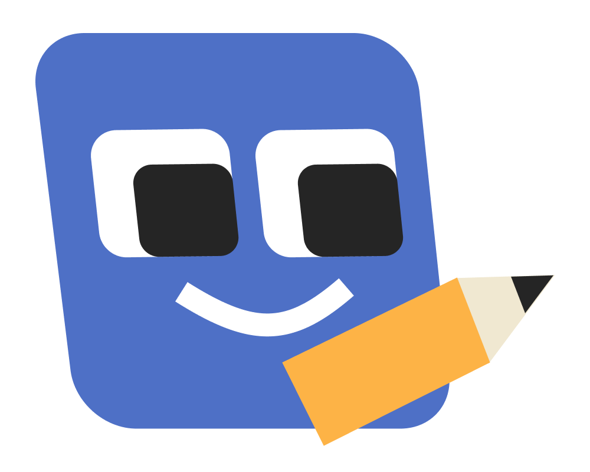

# LiteraDraw
A mobile app that provides feedback on hand-drawn shapes, aiding in the development of pre-writing skills for children.

  

## Description
LiteraDraw is a mobile application designed to assess and provide feedback on hand-drawn shapes created by users, particularly targeting children in the age group of 3-11. The application utilizes image processing and machine learning techniques to classify and grade drawn shapes, offering insights into a child's pre-writing skills development, in accordance with the [Battelle guide](https://ieeexplore.ieee.org/document/9440430).

## Project structure
We've created a Full Stack Mobile Application, where our components are divided amoung two folders:
- **Front-end Components:**  
    The `src` folder is the main container of all the code inside the application. It contains:
    - An `assets` folder (for static images or fonts)
    - A `components` folder (for reusable UI elements)
    - A `routes` folder (for navigation-related code)
    - A `screens` folder (each file in this contains its route).

    The `App.js` file in the root directory is the entry point and main component of the application.

- **Back-end Components:**
    - `app.py`: An API script facilitating communication between the front-end and back-end.
    - `algorithm.py`: Manages data from the back-end, extracting, classifying, and assessing drawings sent from the front-end.
    - `Models` Folder: Contains pre-trained models for drawing classification and assessment.

## Prerequisites

On your **PC**, you will need to have installed:
- [Node.js](https://nodejs.org/en)
- [npm](https://www.npmjs.com) (usually bundled with Node.js)
> 💡 You can run `node --version` in your terminal to confirm if Node.js is already installed onto your machine.
- [Python 3.6+](https://www.python.org)

On your **smartphone**, you will need to have installed:
- [Expo Go](https://expo.dev/client) (available on the App Store and Google Play). You can use this app to scan the QR code that is generated once you start the project server, making it easy to view the project on your own mobile device.

## Installation

Once you have cloned the repository, open your terminal and navigate into the project directory.

> `cd google-solution-challenge`

## Backend
Navigate to the backend directory.  
> `cd backend`

Set up a virtual environment.
> `python -m venv [name of your virtual environment]`    

Install the required dependencies.
> `pip install -r ./requirements`

Initiate the Flask server.
> `flask run --host=0.0.0.0`

After starting the server, make a note of the IPv4 address along with the port. You will need it when running the frontend.
> `if the server is running on http://185.107.80.231:5000`
> `Copy this, use this link: http://185.107.80.231:5000`

## Frontend

Open a new terminal, different to the terminal that you’re running the backend server in, and navigate to the frontend directory.

> `cd frontend`

Install the required packages for the frontend by running:

> `npm i`

This may take a little bit of time, but will eventually generate a folder called `node_modules` in your frontend folder, based on the dependencies specified in the `package-lock.json` file.

Next, in your IDE, open ./src/screens/LiteracyAssessment.js, and **initialize the `localhost` variable** in line [x] to the **same IPv4 address** returned by your Flask server. It should look something like this:

> `const localhost = http://185.107.80.231:5000‘

Now that you’re set up, you can use the Expo CLI to launch the app by leveraging `npx`, a Node.js package runner. View the list of available commands by running:

> `npx expo --help`

To **start the development server**, simply run:

> `npx expo`

As the server starts, a QR code will be displayed in your terminal. Scan this on your smartphone using Expo Go. Expo Go will download a Javascript bundle along with any assets needed and render the React Native app straight to your screen.

## Usage
(We'll add screenshots)

## Contributors
[Francis](github.com/francisblessedkim)  
[Hamza](github.com/SelfTaught-HamzaCodes)  
[Injila](github.com/injl)  
[Jana](github.com/JanaDragovic)

## Credits
(Credits)

 
Thank you,          

**Team LiteraDraw**